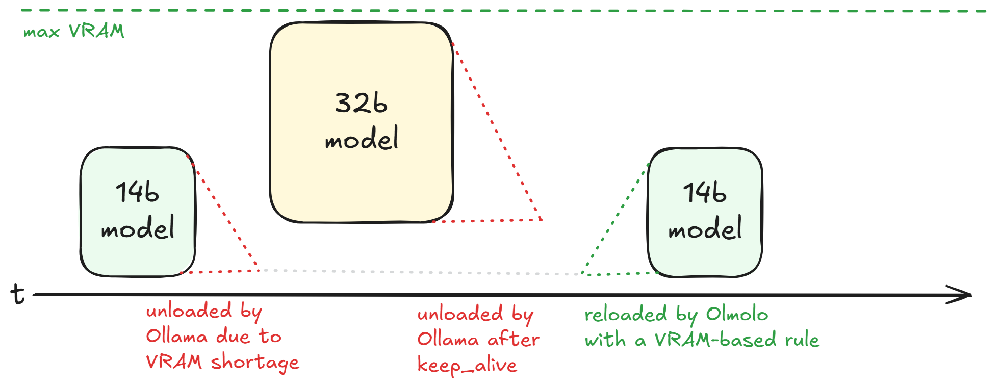

Olmolo helps keeping certain models pre-loaded for your users to minimize wait time - even after Ollama chose to unload them.



### Why not simply increase `keep_alive`?

In a setup with multiple models, Ollama is going to ignore the `keep_alive` of a model and unload it when it needs the VRAM. This is by design and the right thing to do. Once this happens, your previous model will not be reloaded automatically.

## How does it work?

Olmolo iterates over defined rules for each model and decides whether it should ...
 - load a model that is not running
 - extend the `keep_alive` time of a running model
 - unload a model that is running

## Configuration

Olmolo uses `appsettings.json` for its configuration based on the following schema:

```json
{
  "CheckInterval": "00:01:00",      // Time between checks (format: hh:mm:ss)
  "Uri": "http://localhost:11434",  // Ollama API endpoint
  "TotalVram": "24GB",              // Total VRAM available on the Ollama host
  "Models": [
    {
      "Name": "qwen3:14b",          // Model name in Ollama
      "Rules": [
        {
          "VramFree": ">15GB",      // Condition based on available VRAM
          "KeepAlive": "60m"        // sets Ollama keep_alive, Olmolo will extend it when it's about to expire
        },
        {
          "VramFree": "<10GB",
          "KeepAlive": "0"          // "0" will force Ollama to unload the model
        }
      ]
    }
  ]
}
```

In this configuration, Olmolo will ...
 - check every minute if the `qwen3:14b` model is loaded and apply two rules:
   - make sure the model is **loaded** whenever **more than 15GB VRAM** are free
   - make sure the model's `keep_alive` is **extended** whenever as long as more than 15GB VRAM are free
   - make sure the model is **unloaded** whenever **less than 10GB VRAM** are free

> Any `keep_alive` that is greater than the check interval will keep the model loaded forever, as long as the rule's condition are met.

The second rule is just to demonstrate unloading. You will most likely not need this.

### Rule Configuration

Rules are evaluated in sequence for each model:

- **VramFree**: Condition using standard operators (`>`, `<`, `>=`, `<=`, `=`, `!=`) followed by a value in GB
- **KeepAlive**: Duration string indicating how long to keep the model loaded after last use
  - Examples: `10m`, `1h`, `30s`
  - Set to `0` to create an unloading rule

### Recommendations

If you simply want to keep default models "warm" for your users, use a short check interval and a large value for `keep_alive`. Olmolo will only talk to the model if the remaining `keep_alive` is shorter than the next check interval. 

**→ Olmolo will call the model only once the `keep_alive` is about to expire to extend it**.

Note however that a short check interval might conflict with Ollama's (un)loading process depending on your system specs and model sizes. If the interval is too short, you might run into sitations where Olmolo thinks a model is loaded while Ollama is already unloading it. In this case, Olmolo will try to unload it and talk to your model with `keep_alive=0` which will cause the model to get reloaded.


### Limitations

Olmolo won't query the free VRAM from the Ollama host. You have to specify the total amount of VRAM that is available to Ollama in the application settings. Olmolo will calculate the free VRAM by subtracting the used VRAM of running Ollama models from the provided value.

That means Olmolo can not be used to free up VRAM based on other demands, for example during gaming sessions.

## Usage

1. Set up your configuration in `appsettings.json`
2. Run the application:

```bash
dotnet olmolo.dll
```